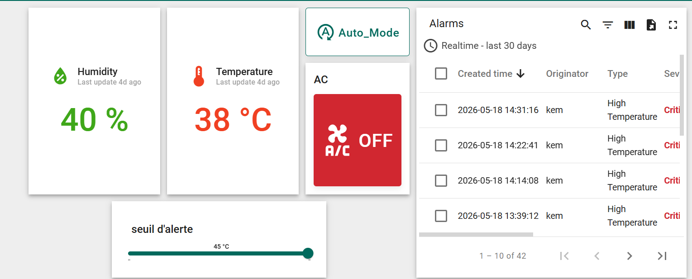
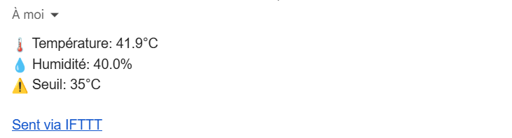
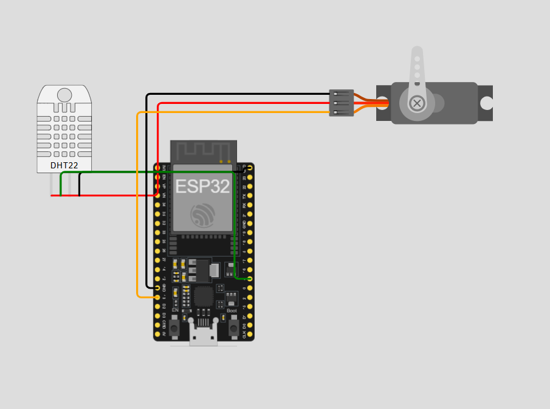

# 🏠 Mini-Projet IoT — Maison Intelligente
### Contrôle de Température & Humidité en Temps Réel

> **Réalisé par :** AIT MBAREK Karim & IDCHAOUDI Youssef  
> **Encadrant :** Pr. M.FARTITCHOU  
> **École :** ENIAD — Berkane | 2025/2026  
> **Filière :** IRSI

---

## 📋 Contexte & Objectifs

Dans le cadre du module IoT et Objets Connectés, nous avons développé un système de maison intelligente capable de :

- **Surveiller** en temps réel la température et l'humidité d'une pièce
- **Réagir automatiquement** aux pics de température en activant un ventilateur
- **Alerter** l'utilisateur par email en cas de dépassement du seuil critique
- **Contrôler** le système à distance depuis un dashboard cloud

---

## 🏗️ Architecture Globale du Système

Le flux de données suit un modèle Edge-to-Cloud strict, garantissant l'intégrité et la traçabilité de chaque mesure :

+----------------+        MQTT TLS        +------------------------+        Webhooks        +-----------------+
| ESP32 + DHT22  | =====================> |  ThingsBoard Cloud     | =====================> |   IFTTT Engine  |
| (Edge Device)  |       Port 8883        | (Ingestion/Rule Chain) |      HTTP POST API     | (Alerting Mail) |
+----------------+                        +------------------------+                        +-----------------+
        |                                             |
        v                                             v
  [Servo/Ventilo]                              [User Dashboard]


  ---

## 🔧 Composants Utilisés

| Composant | Rôle | Détail |
|-----------|------|--------|
| **ESP32** | Microcontrôleur | WiFi intégré, traitement logique |
| **DHT22** | Capteur | Mesure température (°C) & humidité (%) |
| **Servo-moteur** | Actionneur | Simule le ventilateur / climatiseur |
| **Wokwi** | Simulateur | Test sans matériel physique |
| **ThingsBoard Cloud** | Dashboard | Visualisation & contrôle à distance |
| **MQTT TLS** | Protocole | Communication chiffrée port 8883 |
| **IFTTT** | Notifications | Envoi email automatique d'alertes |

---

## ⚙️ Fonctionnalités

### 🌡️ Surveillance Temps Réel
- Lecture DHT22 toutes les 2 secondes
- Publication sur ThingsBoard toutes les 5 secondes
- Affichage température (°C) et humidité (%)

### ❄️ Contrôle Ventilateur — 3 Modes
| Mode | Comportement |
|------|-------------|
| **AUTO** | Temp > Seuil → ON automatique, Temp < Seuil → OFF |
| **MANUEL ON** | Ventilateur forcé ON peu importe la température |
| **MANUEL OFF** | Ventilateur forcé OFF peu importe la température |

### 🔔 Alertes Automatiques
- Alarme **Critical** sur ThingsBoard dès dépassement du seuil
- Email automatique via **IFTTT Webhook** contenant :
  - Température actuelle
  - Humidité actuelle  
  - Seuil qui a déclenché l'alerte
- Anti-spam : **1 alerte maximum par minute**

### 🎚️ Seuil Ajustable à Distance
- Slider sur le dashboard pour modifier le seuil (20°C → 45°C)
- Appliqué immédiatement sur l'ESP32 via RPC MQTT
- Seuil par défaut : **35°C**

---

## 🔒 Sécurité

| Couche | Mécanisme |
|--------|-----------|
| **Transport** | MQTT avec TLS — port 8883, données chiffrées de bout en bout |
| **Authentification device** | Token unique — seul notre device peut publier |
| **Accès dashboard** | Login + mot de passe ThingsBoard obligatoire |

---

## 📊 Dashboard ThingsBoard



**Widgets disponibles :**
- 🌡️ Température en temps réel
- 💧 Humidité en temps réel
- ❄️ Toggle A/C (ON/OFF manuel)
- 🔄 Bouton Mode Auto
- 🎚️ Slider seuil critique (20°C → 45°C)
- 🔴 Table des alarmes avec historique

---

## 📧 Notification Email IFTTT



Lorsque la température dépasse le seuil, un email est envoyé automatiquement contenant la température, l'humidité et le seuil configuré.

---

## 🖥️ Simulation Wokwi



🔗 **[Lancer la simulation Wokwi]((https://wokwi.com/projects/463408939470382081))**

---

## 🚀 Instructions d'Exécution

### Prérequis
- Compte [ThingsBoard Cloud](https://thingsboard.cloud) gratuit
- Compte [IFTTT](https://ifttt.com) peride d'essai  gratuite
- Compte [Wokwi](https://wokwi.com) (optionnel) ou sur Vs code

### Étapes

*

**1. Configurer ThingsBoard**
- Créer un device sur ThingsBoard Cloud
- Copier le token du device
- Créer un dashboard et les widgets dedans

**2. Configurer IFTTT**
- Créer un Applet : Webhook `temp_alert` → Send Email
- Copier votre API Key

**3. Modifier `main.py`**
```python
MQTT_USER = "YOUR_DEVICE_TOKEN_HERE"   # Token ThingsBoard
IFTTT_KEY = "YOUR_IFTTT_KEY_HERE"      # Clé IFTTT
```

**4. Lancer sur Wokwi**
- Ouvrir le lien Wokwi ci-dessus 
- Cliquer ▶ Start Simulation
- Ouvrir le dashboard ThingsBoard 

---


